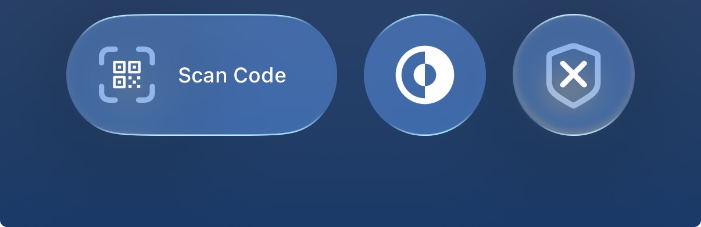

# ControlWidgetTest

This project is a minimal reproducible example for an SFSymbol sizing issue in an iOS Control Widget.

## Issue Summary

The control uses different symbols for on/off:

- On: `checkmark.circle`
- Off: `xmark.circle`

Observed behavior:

- In **Control Center**, both symbols render at the expected visual size.
- On the **Lock Screen**, the **off-state** symbol (`xmark.circle`) is rendered much smaller than in Control Center.

## Screenshot Comparison

| Context | Off State | On State |
|---|---|---|
| Lock Screen |  |  |
| Control Center |  |  |

## Notes

- The images above should represent the same control in both states and contexts.
- The key discrepancy is the off-state symbol size on Lock Screen vs Control Center.
